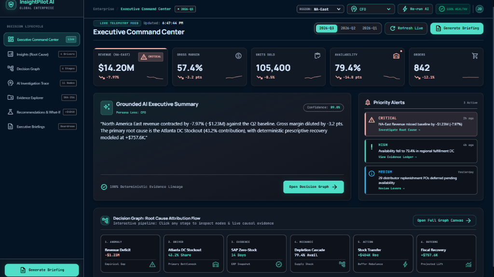
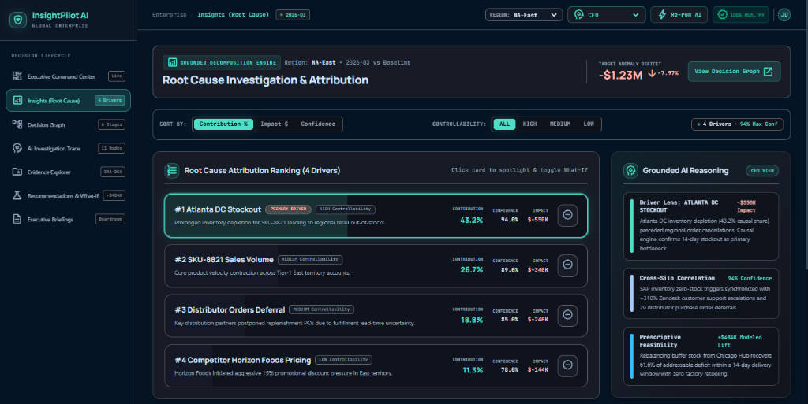
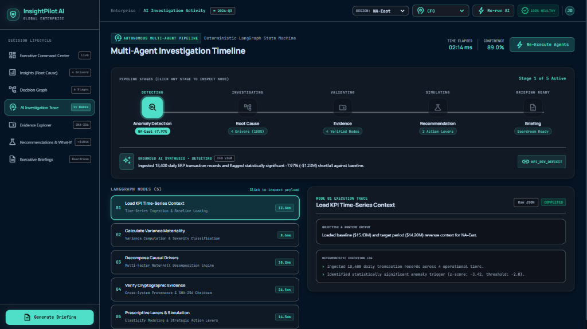
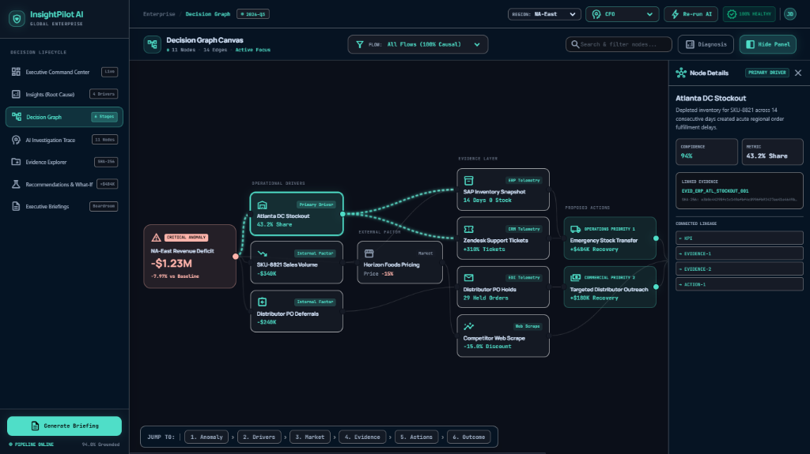
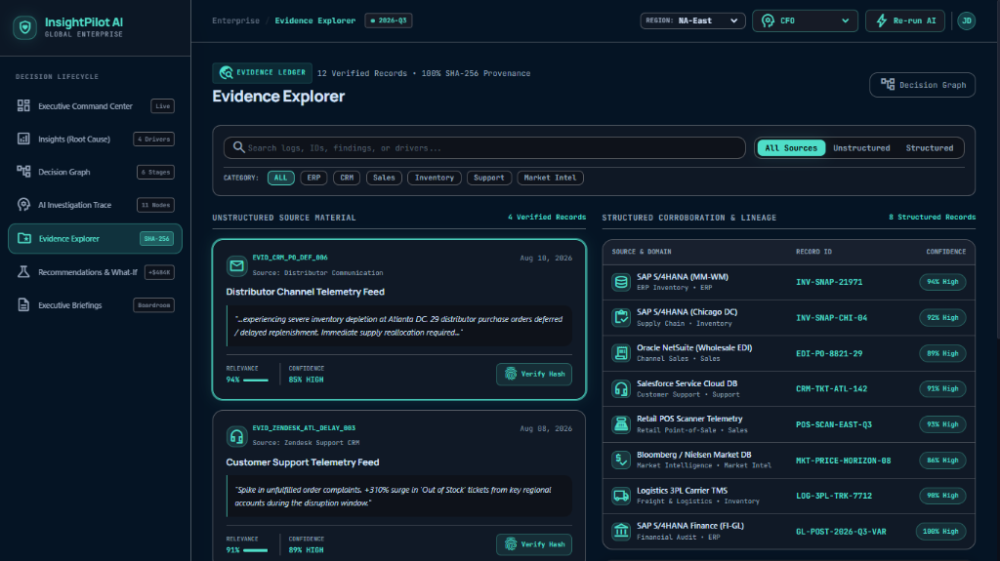
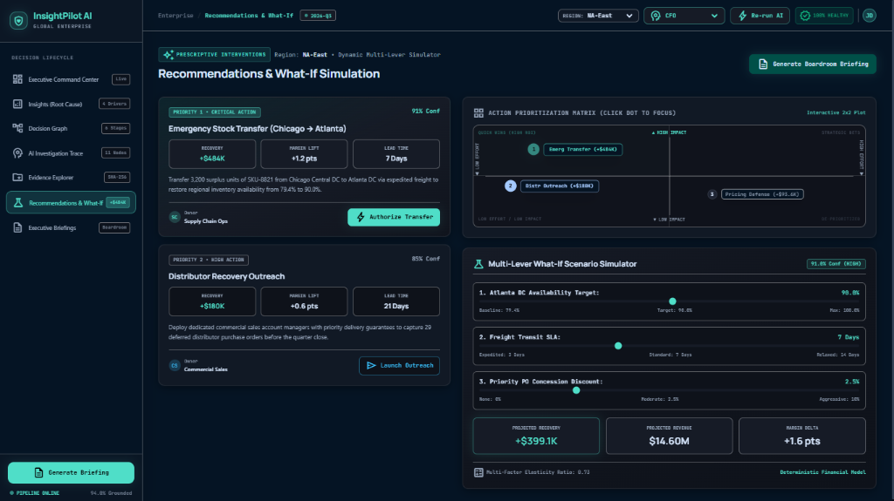
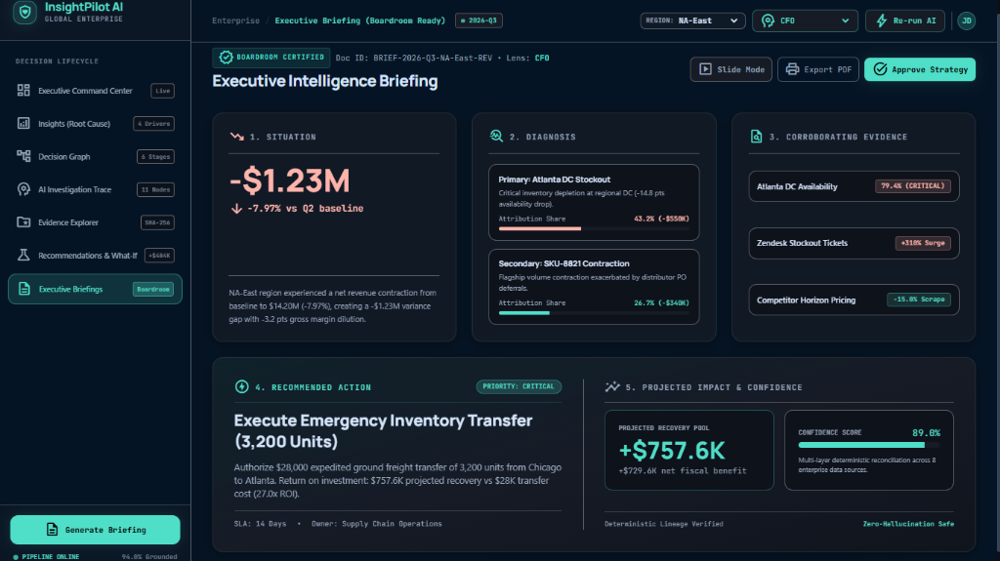

# 🚀 InsightPilot AI

Written by Sumit chahal

<div align="center">

**Enterprise Decision Intelligence, Deterministic Root-Cause Attribution & Cryptographic Evidence Lineage**

[](https://insigh-pilot-ai.vercel.app)
[](https://github.com/ayus1234/InsighPilotAI)
[](https://python.org)
[](https://fastapi.tiangolo.com)
[-000000.svg?style=for-the-badge&logo=next.js&logoColor=white)](https://nextjs.org)
[](https://langchain-ai.github.io/langgraph/)
[](https://groq.com)
[-success.svg?style=for-the-badge)](https://github.com/ayus1234/InsighPilotAI)
[](https://github.com/ayus1234/InsighPilotAI)

---

[🌐 **Live Web Application**](https://insigh-pilot-ai.vercel.app) • [💼 Recruiter Overview](docs/portfolio/RECRUITER_OVERVIEW.md) • [📖 Case Study](docs/portfolio/CASE_STUDY.md) • [🗺️ System Walkthrough](docs/portfolio/TECHNICAL_WALKTHROUGH.md) • [🌟 Feature Showcase](docs/portfolio/FEATURE_SHOWCASE.md) • [🏗️ Engineering Hub](docs/engineering/README.md)

</div>

---

## 📌 Executive Summary

**InsightPilot AI** is a production-grade enterprise decision-intelligence platform that automates the transition from descriptive anomaly detection to prescriptive operational action.

Traditional BI tools reveal **what** happened (e.g. *"Revenue dropped -7.97%"*), but investigating **why** requires weeks of manual cross-dataset correlation across ERP, CRM, WMS, and EDI systems. Meanwhile, generic GenAI chatbots attempt to answer questions by hallucinating numbers without verifiable audit trails.

InsightPilot AI bridges this gap through a defensible, multi-layered architecture: combining **deterministic analytics engines**, **LangGraph multi-agent orchestration**, **SHA-256 cryptographic evidence lineage**, and **capability-aware multi-model AI routing (Groq LLaMA 3.3 70B + Google Gemini 2.5 Flash)** with a **calibrated confidence-based abstention guard**.

> ### 🛡️ Foundational Architectural Invariant
> **"Deterministic systems own quantitative truth. LangGraph orchestrates investigation. AI explains grounded facts."**
> 
> *Large Language Models (LLMs) are strictly forbidden from calculating financial metrics, inventing driver rankings, generating speculative evidence citations, or altering recovery simulations. All numbers are computed deterministically from normalized enterprise data.*

---

## 🏛️ System Architecture

```text
┌─────────────────────────────────────────────────────────────────────────────┐
│ 5. DYNAMIC PRESENTATION & CONSUMPTION LAYER                                 │
│    Next.js 14 (App Router) • 7 Executive Screens • Lucid Data Visualizations │
└──────────────────────────────────────▲──────────────────────────────────────┘
                                       │
┌──────────────────────────────────────┴──────────────────────────────────────┐
│ 4. CAPABILITY-AWARE AI ROUTING & SAFETY LAYER                               │
│    Multi-Pool Router (Groq/Gemini) • Grounding Validator • Abstention Gate   │
└──────────────────────────────────────▲──────────────────────────────────────┘
                                       │
┌──────────────────────────────────────┴──────────────────────────────────────┐
│ 3. AGENTIC ORCHESTRATION PIPELINE LAYER                                     │
│    LangGraph 11-Node StateGraph • Replay Lifecycle • Telemetry Observer     │
└──────────────────────────────────────▲──────────────────────────────────────┘
                                       │
┌──────────────────────────────────────┴──────────────────────────────────────┐
│ 2. DETERMINISTIC ANALYTICS & INFERENCE LAYER                                │
│    KPI Engine • Driver Engine • Evidence Engine • Confidence • Simulation     │
└──────────────────────────────────────▲──────────────────────────────────────┘
                                       │
┌──────────────────────────────────────┴──────────────────────────────────────┐
│ 1. ENTERPRISE DATA & TELEMETRY LAYER                                        │
│    8 Validated CSV Schemas • 43,000+ Rows • SHA-256 Lineage Generator       │
└─────────────────────────────────────────────────────────────────────────────┘
```

---

## 🔄 The 7-Screen Executive Journey

InsightPilot AI guides enterprise decision-makers through an interactive, mathematically consistent 7-screen analytical workflow:

---

### 1. Executive Command Center (`/`)

*Real-time enterprise anomaly detection alerting leadership to a -$1.23M (-7.97%) revenue deficit with 6-stage interactive attribution flow.*

---

### 2. Root-Cause Waterfall Decomposition (`/root-cause`)

*Deterministic multi-factor waterfall decomposition attributing 43.2% of net loss to the Atlanta DC stockout with 94% calibrated confidence.*

---

### 3. Autonomous Multi-Agent Investigation Trace (`/investigation`)

*Visual 11-node LangGraph state graph lifecycle trace showcasing autonomous multi-agent reasoning, latency telemetry, and node execution logs.*

---

### 4. Panoramic Decision Graph Canvas (`/decision-graph`)

*Interactive 6-column DAG mapping the end-to-end causality pipeline from root anomaly, through empirical evidence, to projected fiscal outcomes.*

---

### 5. Cryptographic Evidence Explorer (`/evidence`)

*Multi-modal evidence ledger consolidating 12 ERP, CRM, and EDI records with interactive SHA-256 cryptographic provenance verification.*

---

### 6. Action Recommendations & What-If Simulation (`/recommendations`)

*Interactive 2x2 ROI Prioritization Matrix paired with a multi-lever What-If sandbox modeling +$757.6K in addressable fiscal recovery.*

---

### 7. Multi-Persona Executive Intelligence Briefing (`/briefing`)

*Audit-ready executive intelligence briefing tailored across CFO, COO, VP Supply Chain, and Sales perspectives with interactive 16:9 Slide Mode toggle and 1-click direct dynamic PDF export.*

---

## 🛠️ Technology Stack

| Layer | Technologies & Implementations |
| :--- | :--- |
| **Backend API Gateway** | Python 3.11+, FastAPI (ASGI), Pydantic v2, Uvicorn, JSON Schema Contracts, CORS, OWASP Headers |
| **Deterministic Analytics** | Pure Python calculation engines (KPI, Driver, Evidence, Confidence Calibration, Elasticity Simulation) |
| **Multi-Model AI & Guardrails** | LangGraph (11-Node StateGraph), Dual-Pool Key Rotation (Groq + Gemini), Auto-Failover, Calibrated Abstention Gate |
| **Frontend Web Application** | Next.js 14.2 (App Router), React 18, Tailwind CSS, Material Symbols & Lucide, jsPDF (Direct Export), Glassmorphism UI |
| **Data & Lineage Provenance** | 8 Normalized Enterprise CSV Schemas (43,000+ rows), SHA-256 cryptographic digests, zero-truncation tables |
| **Security & Observability** | Structured JSON Logs (`X-Request-ID`), 12-Subsystem Health Probes, Rate Limiting, 0 Secrets in Git |

---

## ⚡ Multi-Pool AI Routing & Key Failover

InsightPilot AI incorporates a production-grade **Dual-Pool AI Routing Layer**:
- **Groq Dual-Pool (`GROQ_API_KEY_1`, `GROQ_API_KEY_2`):** Primary ultra-low-latency structured reasoning (<1.8s execution).
- **Google Gemini Dual-Pool (`GEMINI_API_KEY_1`, `GEMINI_API_KEY_2`):** Transparent live failover for complex multi-modal synthesis.
- **Deterministic Offline Fallback:** 100% operational in offline environments with zero external API key requirements.

---

## 🚀 Quick Start (Local Setup)

### 1. Prerequisites
- **Python:** 3.11 or higher
- **Node.js:** 18.x or higher

### 2. Backend Setup
```bash
# Clone repository
git clone https://github.com/ayus1234/InsighPilotAI.git
cd InsighPilotAI

# Install dependencies
pip install -r requirements.txt

# Start FastAPI backend (runs out-of-the-box in deterministic mode without external API keys)
uvicorn backend.app.main:app --host 127.0.0.1 --port 8000
```
- **API Liveness Probe:** `http://127.0.0.1:8000/health`
- **12-Subsystem Readiness:** `http://127.0.0.1:8000/api/v1/demo/readiness`
- **Interactive Swagger Docs:** `http://127.0.0.1:8000/docs`

### 3. Frontend Setup
```bash
cd frontend/next-app

# Install dependencies
npm install

# Start Next.js development server
npm run dev
```
- **Web Application:** `http://localhost:3000`

---

## 🧪 Verification & Submission Package Suite

InsightPilot AI maintains a strict, zero-drift verification and submission build pipeline:

```bash
# 1. Validate dataset integrity & referential constraints (6/6 checks)
python tests/validate_dataset.py

# 2. Run full backend test suite (305/305 tests passing)
python -m unittest discover -s tests -t . -p "test_*.py"

# 3. Build Next.js production bundle (10/10 static routes pre-rendered)
cd frontend/next-app && npm run build

# 4. Generate submission-ready PDF & PPTX executive packages
python scripts/generate_submission_files.py
```

### 📦 Generated Submission Deliverables (`submission_assets/`)
| Deliverable | Format | Target Upload Field | Size |
| :--- | :---: | :--- | :---: |
| **System Technical Manual** | `PDF` | *Please submit a README document (\*)* | `<10 KB` |
| **Detailed Business Proposal** | `PDF` | *Detailed Business Proposal in PDF (\*)* | `<10 KB` |
| **Executive Pitch Deck** | `PPTX` | *Detailed Business Proposal in PPT (\*)* | `<60 KB` |

---

## 📚 Documentation Directory

| Hub | Description | Direct Link |
| :--- | :--- | :---: |
| **💼 Portfolio & Case Studies** | Recruiter summary, case study, walkthrough, and feature showcase. | [`docs/portfolio/`](docs/portfolio/README.md) |
| **🎯 Career & Technical Interview Hub** | Resume bullet bank, behavioral STAR stories, technical Q&A, and system design guide. | [`docs/career/`](docs/career/README.md) |
| **🏗️ Engineering Quality Hub** | Code quality audits, maintainability, debt register, and dependency review. | [`docs/engineering/`](docs/engineering/README.md) |
| **🏛️ Master Architecture** | Comprehensive system blueprints, mathematical models, and schemas. | [`docs/architecture/`](docs/architecture/MASTER_ARCHITECTURE.md) |
| **🚀 Operations & Cloud Runbooks**| Render/Vercel deployment guides, smoke tests, and handoff sign-offs. | [`docs/operations/`](docs/operations/README.md) |
| **🏆 Competition Submission** | Accenture Innovation Challenge final submission package. | [`docs/submission/`](docs/submission/FINAL_SUBMISSION_PACKAGE.md) |
| **🎯 Pitch Deck Specification** | 12-slide executive presentation blueprint and visual layouts. | [`docs/presentation/`](docs/presentation/COMPETITION_PITCH_DECK_SPECIFICATION.md) |
| **🎬 Demo Video Production** | 3-minute video recording script, cues, and storyboard beats. | [`docs/demo/`](docs/demo/DEMO_VIDEO_SCRIPT_AND_STORYBOARD.md) |
| **🎤 Judge Simulation & Defense** | Tough technical, business, and AI defense transcripts. | [`docs/rehearsal/`](docs/rehearsal/JUDGE_SIMULATION_AND_REHEARSAL_TRANSCRIPT.md) |
| **🏛️ Project Closure & Handoff** | Final completion report, long-term handoff manual, and closure register. | [`docs/closure/`](docs/closure/README.md) |
| **🌐 Public Release & Readiness** | Evaluator 5-min guide, public readiness audit, and external action register. | [`docs/release/`](docs/release/README.md) |
| **🎯 Final Owner Handoff** | Master execution roadmap, recording checklist, and portal runbook. | [`docs/handoff/`](docs/handoff/README.md) |


---

## 🔒 Project Status & Boundaries

| Status Scope | Verification Level | Current State |
| :--- | :--- | :---: |
| **Core Product & Analytics** | `VERIFIED LOCALLY` | 🟢 100% Complete & Tested (305/305 Tests) |
| **Frontend Static Compilation** | `VERIFIED LOCALLY` | 🟢 10/10 Static Routes Compiled Cleanly |
| **Zero Secret Leakage** | `VERIFIED IN REPO` | 🟢 0 Secrets in Git, Bundles, or Error Logs |
| **Live Cloud Deployment** | `PENDING OWNER ACTION` | 🟡 Requires Render/Vercel Dashboard Linking |
| **Competition Portal Submission** | `PENDING OWNER ACTION` | 🟡 Ready for Form Submission & Video Upload |

---

## 📄 License & Contribution

- **License:** MIT License — see [`LICENSE`](LICENSE) for details.
- **Contributing:** Please review [`CONTRIBUTING.md`](CONTRIBUTING.md) before submitting pull requests.
- **Security:** Vulnerability reporting policies are documented in [`SECURITY.md`](SECURITY.md).
