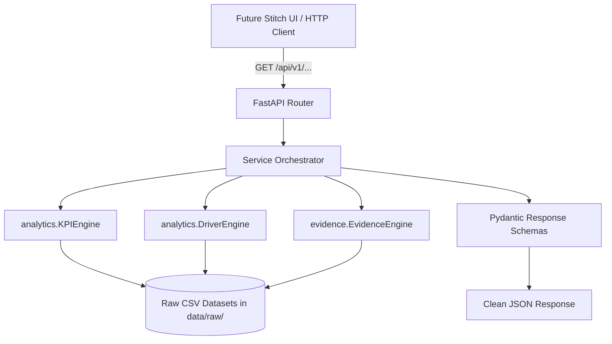

# InsightPilot AI — Backend REST API Specification

> **Accenture Innovation Challenge 2026 — Track 3: BusinessIntelligence.ai**  
> **Document Version:** 2.0.0  
> **Status:** Production-Ready Backend Foundation (Step 7)  
> **Role:** Technical Authority on REST Endpoints, Pydantic Models & API Contracts

---

## 1. Architectural Overview & Component Boundaries

The **InsightPilot AI API** is built with **FastAPI** to expose the deterministic quantitative analytics and cryptographic evidence graphs built in Steps 5 & 6. It follows strict separation of concerns:

- **Business Logic Layer (`analytics/` & `evidence/`):** Pure deterministic computations, variance evaluation, multi-factor driver attribution, and lineage tracking.
- **Service Orchestration Layer (`backend/app/services/`):** Translates incoming HTTP requests into analytical engine parameters and formats domain results into typed Pydantic payloads.
- **Route & Transport Layer (`backend/app/routes/`):** Fast, asynchronous HTTP handlers with validation, CORS, and standardized error responses.



---

## 2. Running Locally

```bash
# 1. Install dependencies
pip install -r requirements.txt

# 2. Run with uvicorn
uvicorn backend.app.main:app --reload --host 127.0.0.1 --port 8000
```

Interactive Documentation:
- **Swagger UI:** `http://127.0.0.1:8000/docs`
- **ReDoc:** `http://127.0.0.1:8000/redoc`
- **OpenAPI JSON:** `http://127.0.0.1:8000/openapi.json`

---

## 3. Endpoints & Example Payloads

### 3.1 Health Probe
`GET /health`
```json
{
  "status": "ok",
  "service": "insightpilot-api",
  "version": "2.0.0"
}
```

---

### 3.2 List All KPIs
`GET /api/v1/kpis?region=NA-East&prev_period_id=2026-Q2&curr_period_id=2026-Q3`
```json
{
  "total_count": 5,
  "kpis": [
    {
      "id": "north_america_east_revenue",
      "name": "North America East Revenue",
      "region": "NA-East",
      "current_period": "2026-Q3",
      "previous_period": "2026-Q2",
      "current_value": 14200000.05,
      "previous_value": 15430000.06,
      "variance_amount": -1230000.01,
      "percent_change": -7.97,
      "materiality_status": "CRITICAL_NEGATIVE_VARIANCE",
      "unit": "USD",
      "source_datasets": ["revenue.csv"]
    },
    {
      "id": "gross_margin",
      "name": "Gross Margin %",
      "region": "NA-East",
      "current_period": "2026-Q3",
      "previous_period": "2026-Q2",
      "current_value": 46.04,
      "previous_value": 49.24,
      "variance_amount": -3.20,
      "percent_change": -3.20,
      "materiality_status": "WARNING",
      "unit": "PERCENT",
      "source_datasets": ["margin.csv", "revenue.csv"]
    }
  ]
}
```

---

### 3.3 Single KPI State
`GET /api/v1/kpis/north_america_east_revenue`
```json
{
  "id": "north_america_east_revenue",
  "name": "North America East Revenue",
  "region": "NA-East",
  "current_period": "2026-Q3",
  "previous_period": "2026-Q2",
  "current_value": 14200000.05,
  "previous_value": 15430000.06,
  "variance_amount": -1230000.01,
  "percent_change": -7.97,
  "materiality_status": "CRITICAL_NEGATIVE_VARIANCE",
  "unit": "USD",
  "source_datasets": ["revenue.csv"]
}
```

---

### 3.4 Root Cause Investigation
`GET /api/v1/investigations/north_america_east_revenue`
```json
{
  "investigation_id": "INV-EXEC-2026-NAE-001",
  "timestamp": "2026-08-22T13:25:00Z",
  "persona_id": "CFO",
  "kpi": {
    "id": "north_america_east_revenue",
    "name": "North America East Revenue",
    "current_value": 14200000.05,
    "previous_value": 15430000.06,
    "variance_amount": -1230000.01,
    "percent_change": -7.97,
    "materiality_status": "CRITICAL_NEGATIVE_VARIANCE"
  },
  "drivers": [
    {
      "driver_id": "atlanta_dc_stockout",
      "driver_name": "Atlanta DC Stockout",
      "contribution_pct": 43.2,
      "impact_usd": -550000.0,
      "confidence_score": 94,
      "rank": 1,
      "evidence_ids": ["EVID_ERP_ATL_STOCKOUT_001", "EVID_ERP_TRANSFER_LOG_002", "EVID_ZENDESK_ATL_DELAY_003"]
    },
    {
      "driver_id": "sku_8821_sales_volume",
      "driver_name": "SKU-8821 Sales Volume Drop",
      "contribution_pct": 26.7,
      "impact_usd": -340000.0,
      "confidence_score": 89,
      "rank": 2,
      "evidence_ids": ["EVID_CRM_SKU8821_SALES_004", "EVID_ERP_BOM_MARGIN_005"]
    },
    {
      "driver_id": "distributor_orders",
      "driver_name": "Distributor Orders Deferral",
      "contribution_pct": 18.8,
      "impact_usd": -240000.0,
      "confidence_score": 85,
      "rank": 3,
      "evidence_ids": ["EVID_CRM_PO_DEF_006", "EVID_COMM_DIST_EMAIL_007"]
    },
    {
      "driver_id": "competitor_horizon_pricing",
      "driver_name": "Competitor Horizon Foods Price Cut (-15%)",
      "contribution_pct": 11.3,
      "impact_usd": -144000.0,
      "confidence_score": 78,
      "rank": 4,
      "evidence_ids": ["EVID_MKT_HORIZON_PROMO_008", "EVID_ZENDESK_COMP_FEEDBACK_009"]
    }
  ],
  "evidence_summary": {
    "evidence_ids": [
      "EVID_ERP_ATL_STOCKOUT_001",
      "EVID_ERP_TRANSFER_LOG_002",
      "EVID_ZENDESK_ATL_DELAY_003",
      "EVID_CRM_SKU8821_SALES_004",
      "EVID_ERP_BOM_MARGIN_005",
      "EVID_CRM_PO_DEF_006",
      "EVID_COMM_DIST_EMAIL_007",
      "EVID_MKT_HORIZON_PROMO_008",
      "EVID_ZENDESK_COMP_FEEDBACK_009"
    ],
    "source_count": 3,
    "source_domains": ["ERP", "CRM_SALES", "SUPPORT_MARKET_INTEL"]
  },
  "overall": {
    "overall_confidence": 89,
    "confidence_label": "HIGH",
    "abstention": false,
    "abstention_reason": null
  },
  "lineage_graph": {
    "kpi_node": "north_america_east_revenue",
    "driver_nodes": ["atlanta_dc_stockout", "sku_8821_sales_volume", "distributor_orders", "competitor_horizon_pricing"],
    "evidence_nodes": [
      "EVID_ERP_ATL_STOCKOUT_001",
      "EVID_ERP_TRANSFER_LOG_002",
      "EVID_ZENDESK_ATL_DELAY_003",
      "EVID_CRM_SKU8821_SALES_004",
      "EVID_ERP_BOM_MARGIN_005",
      "EVID_CRM_PO_DEF_006",
      "EVID_COMM_DIST_EMAIL_007",
      "EVID_MKT_HORIZON_PROMO_008",
      "EVID_ZENDESK_COMP_FEEDBACK_009"
    ]
  }
}
```

---

### 3.5 Single Evidence Node & Lineage Trace
`GET /api/v1/evidence/EVID_ERP_ATL_STOCKOUT_001`
```json
{
  "evidence_id": "EVID_ERP_ATL_STOCKOUT_001",
  "source": "SAP S/4HANA Supply Chain Logistics (MM-WM)",
  "source_record_id": "INV-SNAP-21971",
  "source_domain": "ERP",
  "timestamp": "2026-08-05T06:00:00Z",
  "freshness": {
    "age_hours": 1344.0,
    "status": "RECENT"
  },
  "evidence_type": "TELEMETRY_LOG",
  "analytical_method": "DC Stockout Duration & Demand Gap Analysis",
  "finding_summary": "Atlanta-DC-01 inventory availability dropped to 68.2% for SKU-8821 with 1,986 available vs 2,912 required demand.",
  "contribution": {
    "percentage": 43.2,
    "monetary_impact_usd": -550000.0
  },
  "confidence": {
    "score": 94,
    "label": "HIGH"
  },
  "supports_driver": "atlanta_dc_stockout",
  "supports_kpi": "north_america_east_revenue",
  "lineage": {
    "source_table": "sap_mm_inventory_snapshots",
    "pipeline_job_id": "JOB_ERP_STOCK_FEED_20260815_01",
    "verification_hash": "sha256:c7ba9851c56f6d474290bf459b5cd09b9027eed31589ca47d582b71ca80e91d9"
  },
  "evidence_rank": 1,
  "ranking_score": 95.0
}
```

`GET /api/v1/evidence/EVID_ERP_ATL_STOCKOUT_001/lineage`
```json
{
  "evidence_id": "EVID_ERP_ATL_STOCKOUT_001",
  "kpi": "north_america_east_revenue",
  "driver": "atlanta_dc_stockout",
  "source_system": "SAP S/4HANA Supply Chain Logistics (MM-WM)",
  "source_domain": "ERP",
  "source_record_id": "INV-SNAP-21971",
  "lineage_metadata": {
    "source_table": "sap_mm_inventory_snapshots",
    "pipeline_job_id": "JOB_ERP_STOCK_FEED_20260815_01",
    "verification_hash": "sha256:c7ba9851c56f6d474290bf459b5cd09b9027eed31589ca47d582b71ca80e91d9"
  },
  "verification_hash": "sha256:c7ba9851c56f6d474290bf459b5cd09b9027eed31589ca47d582b71ca80e91d9"
}
```

---

## 4. Error Handling Specification

All API errors return a uniform, machine-readable JSON structure:

```json
{
  "error": {
    "code": "KPI_NOT_FOUND",
    "message": "KPI with identifier 'invalid_kpi' is not recognized or supported by the analytics engine."
  }
}
```

| HTTP Status | Error Code | Description |
|---|---|---|
| `400` | `INVALID_INVESTIGATION_REQUEST` | Malformed parameters or unsupported date ranges. |
| `404` | `KPI_NOT_FOUND` | Requested KPI identifier is unrecognized. |
| `404` | `EVIDENCE_NOT_FOUND` | Requested evidence node ID does not exist. |
| `422` | `VALIDATION_ERROR` | Request parameters failed schema constraints. |
| `500` | `INTERNAL_SERVER_ERROR` | Internal failure without leaking stack traces. |

---

## 5. CORS Configuration

CORS origins are configured through `CORS_ORIGINS` in `.env`:
```text
CORS_ORIGINS=http://localhost:3000,http://localhost:5173,http://127.0.0.1:3000,http://127.0.0.1:5173
```
Allows cross-origin requests from standard React / Next.js / Vite development servers.

---

## 6. Current Scope & Intentional Limitations

> **Architecture Status:**
> - **Exposes:** Deterministic KPI analytics, driver attributions, and evidence lineage.
> - **Not Implemented in Step 7:** Gemini LLM reasoning, RAG vector search, what-if simulations, recommendation algorithms, user authentication (OAuth2/JWT), and database persistence (PostgreSQL/Redis).
