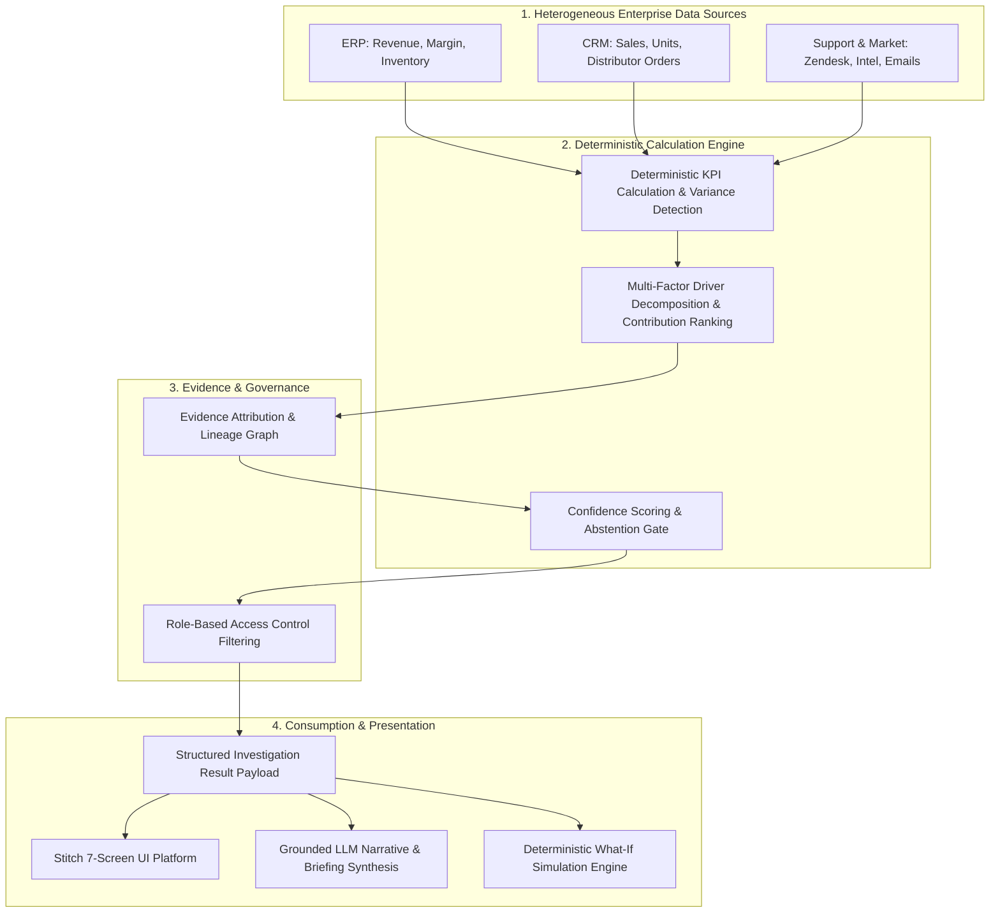

# InsightPilot AI — Data & KPI Contracts Architecture

> **Accenture Innovation Challenge 2026 — Track 3: BusinessIntelligence.ai**  
> **Document Version:** 2.0.0  
> **Role:** Technical Specification & Data Contract Authority

---

## 1. Architectural Data Flow Pipeline

InsightPilot AI enforces an unbroken, audited data pipeline that connects raw enterprise records to user interface renderings and LLM narrative explanations.

---

## 2. Specification of Schema Contracts

All data structures are codified as JSON Schemas in `data/schemas/` to ensure deterministic contract adherence across every layer of the system.

### 2.1 KPI Semantic Contract (`data/schemas/kpi_contract.json`)
Defines the mathematical, temporal, and governance rules for all 5 core connected KPIs:

| KPI ID | Name | Source Domain | Calculation Formula | Movement Formula | Materiality Threshold |
|---|---|---|---|---|---|
| `north_america_east_revenue` | North America East Revenue | ERP | `SUM(net_revenue)` | $\frac{\text{Curr} - \text{Prev}}{\text{Prev}} \times 100$ | $\ge 5\%$ drop (Locked: $-8.0\%$) |
| `gross_margin` | Gross Margin | ERP | $\frac{\text{Revenue} - \text{COGS}}{\text{Revenue}} \times 100$ | $\text{Curr\%} - \text{Prev\%}$ | $< 39.0\%$ (Target: $42.5\%$) |
| `units_sold` | Units Sold | CRM_SALES | `SUM(units_delivered)` | $\frac{\text{Curr} - \text{Prev}}{\text{Prev}} \times 100$ | $\ge 7\%$ drop |
| `distributor_orders` | Distributor Orders | CRM_SALES | `COUNT(DISTINCT po_id)` | $\frac{\text{Curr} - \text{Prev}}{\text{Prev}} \times 100$ | $\ge 10\%$ drop |
| `inventory_availability` | Inventory Availability | ERP | $\frac{\text{Available Units}}{\text{Required Demand Units}} \times 100$ | $\text{Curr\%} - \text{Prev\%}$ | $< 85.0\%$ (Target: $95.0\%$) |

---

### 2.2 Driver Semantic Contract (`data/schemas/driver_contract.json`)
Decomposes the $-8.0\%$ revenue drop into four quantified drivers:
1. **`atlanta_dc_stockout` (Internal / Operational):** $44.0\%$ contribution ($-\$528\text{k}$, $94\%$ confidence).
2. **`sku_8821_sales_volume` (Internal / Commercial):** $26.0\%$ contribution ($-\$312\text{k}$, $89\%$ confidence).
3. **`distributor_orders` (Internal / Channel):** $18.0\%$ contribution ($-\$216\text{k}$, $85\%$ confidence).
4. **`competitor_horizon_pricing` (External / Market):** $12.0\%$ contribution ($-\$144\text{k}$, $78\%$ confidence).

---

### 2.3 Data Source Contract (`data/schemas/data_source_contract.json`)
Establishes integration specifications across the three simulated enterprise data domains:
- **`SRC_ERP_SAP` (ERP):** Relational SQL store for revenue invoices, inventory DC snapshots, and COPA margin allocations.
- **`SRC_CRM_SALESFORCE` (CRM/Sales):** Order pipelines, SKU delivery line items, and wholesale distributor purchase orders.
- **`SRC_SUPPORT_MKT_INTEL` (Support & Market):** Zendesk support tickets, distributor email threads, and competitive price scraping data.

---

### 2.4 Entity Schemas (`data/schemas/entities/`)
Defines the schema of transaction and observation records:
- `revenue.json`: Net billed revenue invoices with region, customer, and SKU granularity.
- `inventory.json`: Daily DC stock snapshots with on-hand, available, and demand units.
- `margin.json`: Revenue vs COGS breakdown with material cost and expedited freight line items.
- `sales.json`: Order delivery status and unit-price transaction records.
- `distributor_order.json`: Purchase orders, distributor tiering, and deferral reasons.
- `support_ticket.json`: Support escalation categories, severity, and NLP sentiment polarity.
- `distributor_communication.json`: Email text extracts and factual claims.
- `market_intelligence.json`: Competitor pricing benchmarks and promotional tracking.

---

### 2.5 Evidence Contract (`data/schemas/evidence_contract.json`)
Every analytical finding is linked to an audited evidence node containing:
- `evidence_id` & `source_record_id`
- `timestamp` & `freshness` ($\Delta t$, classified as `LIVE`, `RECENT`, or `STALE`)
- `analytical_method` (e.g. *Stockout Gap Analysis*, *Cross-Price Elasticity*)
- `contribution` ($w_i$) & `confidence`
- `lineage` (source table, ETL job ID, and cryptographic verification hash)

---

### 2.6 Confidence & Abstention Contract (`data/schemas/confidence_contract.json`)
Standardizes uncertainty scoring across a 0–100 scale:
- **HIGH ($\ge 80$):** Multi-source corroboration with direct telemetry.
- **MEDIUM ($65 - 79$):** Solid single-source signal with minor ambiguity.
- **LOW ($< 65$):** **Mandatory Abstention Gate.** The system emits:
  `"No reliable primary driver identified. Additional data required."`

---

### 2.7 Investigation Result Contract (`data/schemas/investigation_result.json`)
The central payload emitted by the deterministic analytical engine, consumed by the UI components and used to ground LLM prompt contexts.

---

### 2.8 Persona Contract (`data/schemas/persona_contract.json`)
Defines the distinct analytical lens for two enterprise users:
- **CFO:** Full portfolio view, margin erosion, financial value-at-risk, Capex/Opex strategic interventions.
- **Regional Sales Manager:** Regional operational focus, stock availability, distributor fulfillment lag, inter-DC stock transfers.

---

### 2.9 Role-Based Access Control (RBAC) Contract (`data/schemas/rbac_contract.json`)
Enforces granular resource-level permissions (e.g. masking confidential COGS and margin models from non-executive personas while granting full operational visibility).

---

### 2.10 What-If Simulation Contract (`data/schemas/simulation_contract.json`)
Codifies parameters for deterministic counterfactual analysis:
- **Input Slider:** Inventory Availability ($72\% \to 95\%$)
- **Output Recovery:** Projected Revenue Recovery ($+\$385\text{k} - +\$510\text{k}$) and Margin Recovery ($+1.4\% - +2.1\%$) governed by explicit mathematical elasticity models.

---

## 3. Contract Enforcement Principle

No component in later implementation steps (synthetic generator, analytics engine, FastAPI backend, UI state binders, or Gemini prompts) is permitted to define custom metrics, altered driver names, or uncontracted fields. All code must adhere to these version-controlled schema contracts.
