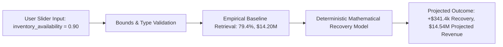

# InsightPilot AI — What-If Simulation Engine Architecture

> **Accenture Innovation Challenge 2026 — Track 3: BusinessIntelligence.ai**  
> **Document Version:** 2.0.0  
> **Status:** Production-Ready (Step 9)  
> **Role:** Technical Authority on Deterministic What-If Scenario Projections & Parameter Bounds

---

## 1. Simulation Architecture

The InsightPilot AI What-If Simulation Engine enables interactive slider manipulation of key operational parameters to calculate projected revenue and margin recovery.

The engine executes pure mathematical functions with **zero non-deterministic ML models, zero randomized heuristics, and zero LLM dependencies**.

---

## 2. Empirical Baseline State

Baseline availability is derived dynamically from raw ERP inventory telemetry snapshots (`data/raw/inventory.csv`):
- **Disruption Facility:** Atlanta DC (`Atlanta-DC-01`)
- **Disruption Window:** August 1 – August 19, 2026
- **Baseline Availability:** **$79.4\%$** ($0.794$)
- **Baseline Q3 NA-East Revenue:** **$\$14,200,000.05$**

---

## 3. Deterministic Mathematical Formulation

When the user adjusts inventory availability from baseline $A_{\text{base}} = 0.794$ to target $A_{\text{scenario}} = 0.900$:

1. **Availability Delta:**
   $$\Delta A = A_{\text{scenario}} - A_{\text{base}} = 0.900 - 0.794 = +0.106 \quad (+10.6\%)$$

2. **Availability Improvement Factor:**
   $$I_F = \frac{\Delta A}{1.0 - A_{\text{base}}} = \frac{0.106}{0.206} \approx 0.5146$$

3. **Recoverable Revenue Pool:**
   $$R_{\text{pool}} = |\text{Atlanta DC Stockout Impact}| + |\text{SKU-8821 Deficit Impact}| \times 0.60 = \$550,000 + \$204,000 = \$754,000.00$$

4. **Projected Revenue Recovery:**
   $$\text{Recovery}_{\text{USD}} = R_{\text{pool}} \times I_F \times \text{Elasticity Factor (0.88)} = \$754,000 \times 0.5146 \times 0.88 = \mathbf{\$341,422.91}$$

5. **Projected Total Revenue:**
   $$\text{Projected Revenue} = \$14,200,000.05 + \$341,422.91 = \mathbf{\$14,541,422.96}$$

6. **Projected Margin Improvement:**
   $$\Delta \text{Margin}_{\%} = I_F \times 1.4\text{ pts} = \mathbf{+0.72\text{ pts}}$$

---

## 4. Input Bounds & Validation Constraints

- **Type:** Must be numeric (`float` or `int`).
- **Normalized Range:** $0.0 \le \text{input} \le 1.0$ (or $0.0\% \le \text{input} \le 100.0\%$).
- **Out of Bounds Rejection:** Values $< 0.0$ or $> 100.0$ return HTTP `400 Bad Request` with code `INVALID_SIMULATION_INPUT`.
- **Sub-Baseline Handling:** Scenarios with target availability $\le$ baseline yield $\$0.00$ incremental recovery without error.

---

## 5. Source Data Immutability

Simulations are completely stateless and functional. Evaluating multiple scenarios leaves the underlying CSV datasets and baseline calculations completely unchanged.
